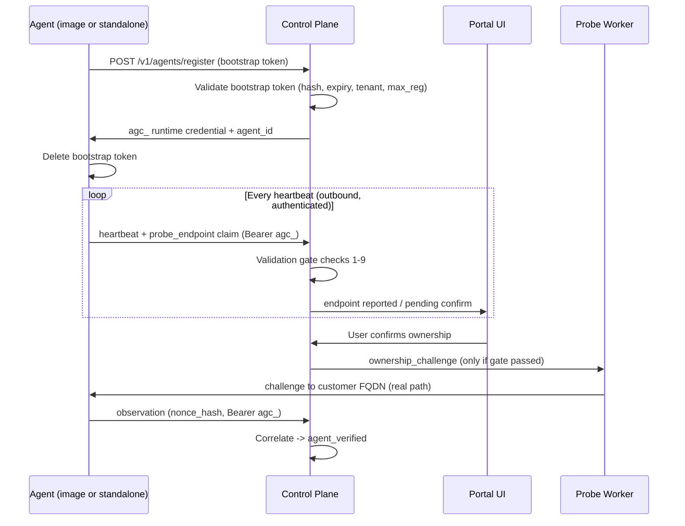

# Deployment Modes and Onboarding

> **Status: design / planned.** This document specifies the target design for how customers
> deploy validation coverage (standalone agent, container image, or no deployment at all),
> how the platform authenticates and verifies those deployments, and how onboarding stays
> low-friction. It builds on shipped primitives — bootstrap tokens
> ([`03-api-key-and-token-lifecycle.md`](03-api-key-and-token-lifecycle.md)), the outbound
> control channel ([`01-agent-architecture.md`](01-agent-architecture.md),
> [ADR-0002](../adr/0002-outbound-agent-control.md)), the opt-in canary listener
> ([`04-detection-modes.md`](04-detection-modes.md)), signed probe workers
> (`src/services/probeCoordinator.mjs`), and placement confidence
> ([`06-placement-guide.md`](06-placement-guide.md)). Items here are **not** implemented
> unless they are cross-referenced from `PROGRESS.md` with `[x]` and staging evidence.

## 1. Why this document exists

Customers asked for two things:

1. A **container image** they can drop into their environment for fast onboarding, in
   addition to the standalone host agent.
2. A way for AstraNull to **probe their public path** and prove exposure, with the
   deployed component authenticating first and reporting where to probe.

Both must be reconciled with AstraNull's non-negotiable product rules
([`AGENTS.md`](../../AGENTS.md), [`docs/product/02-scope-and-principles.md`](../product/02-scope-and-principles.md)):
no default cloud access, no IP-inventory discovery, **outbound-only management**, evidence
over assumptions, and safe-by-default probes.

## 2. Core design decisions

| Decision | Choice | Rationale |
|---|---|---|
| Number of agents | **One agent codebase.** The image is the same `astranull-agent` wrapped in a container. | No second product to maintain; identical registration, credential, observation, and update paths. |
| Packaging | Standalone (installer/deb/rpm/tarball/Helm) **and** container image. | Meets "give me an image" without forking behavior. |
| Management channel | **Outbound-only, always** (ADR-0002). | No inbound management port is ever required. This is the primary reason security teams approve the agent. |
| Inbound to the agent | **Opt-in canary listener only**, and never a management port. | Preserves no-access-first. See §5 for how ownership is proven with or without it. |
| What AstraNull probes | The **customer-declared FQDN/IP** (through their real WAF/CDN/LB), never an agent-asserted address on its own. | Tests the real path and closes an SSRF/abuse hole (see §7). |
| Secrets in artifacts | **Never baked in.** Token supplied at runtime via env or mounted secret. | `docker history` / image layers must contain no credential. |
| No-deploy customers | **External-only mode** with honestly labeled lower confidence. | Lowers the barrier to first value; upsell to agent-assisted later. |

## 3. Validation modes

| Mode | Customer deploys | Inbound needed | AstraNull does | Verdict strength |
|---|---|---|---|---|
| **A1 — Agent, observe-only** (recommended default) | Agent (standalone or image) on/near the target path | **None** — outbound 443 only | External probe hits the customer's real FQDN; agent observes via packet-metadata / log-tail / mirror and uploads outbound | **Strong** — path proven, no inbound |
| **A2 — Agent + canary listener** (opt-in) | Agent with `canary_listener` enabled behind the customer's path | One customer-approved canary port | Adds a dedicated reachable canary target behind the real path | **Strong** — dedicated canary proof |
| **B — External-only** (no deploy) | Nothing | None | Signed probe worker scans the declared FQDN/IP only | **Moderate** — `external_only`, no inside proof |

Modes coexist per target group: some targets agent-assisted, some external-only.

```mermaid
flowchart TB
    subgraph A1 [A1 Agent observe-only - recommended]
        d1[Deploy agent - image or standalone]
        a1[Register outbound, token validated]
        o1[Agent observes existing traffic - no inbound port]
        p1[Probe worker hits customer real FQDN]
        s1[Strong verdict: probe + observation correlated]
    end
    subgraph A2 [A2 Agent + opt-in canary]
        c2[Enable customer-approved canary listener]
        p2[Probe worker hits FQDN then canary]
        s2[Strong verdict: dedicated canary proof]
    end
    subgraph B [B External-only]
        e1[Declare FQDN/IP only]
        e2[External scans]
        w1[Moderate verdict: external_only]
    end
    d1 --> a1 --> o1 --> p1 --> s1
    c2 --> p2 --> s2
    e1 --> e2 --> w1
```



## 4. One agent, two packaging options

There is **no separate canary appliance binary**. Same `agents/linux/astranull-agent.mjs`
everywhere; only packaging differs.

| Packaging | What the customer gets | Use case |
|---|---|---|
| Standalone | `install.sh`, deb/rpm, Helm, or raw file | Agent on origin VM, backend, K8s node |
| Image | Pre-built container with the agent inside | Fast deploy — `docker run` / ECS / Cloud Run / K8s |

The container image (`agents/linux/Dockerfile`) already ships non-root with no baked token.
The hardened production profile is in §8.

```dockerfile
# Conceptual — image wraps the existing agent; no secrets in layers.
FROM gcr.io/distroless/nodejs22-debian12   # hardened target (see §8)
COPY astranull-agent.mjs /opt/astranull/
USER 10001
ENTRYPOINT ["node", "/opt/astranull/astranull-agent.mjs"]
# API URL, token, FQDN — ALL from runtime env / mounted secret.
```

## 5. Ownership verification (three-party proof)

The hard question the customer raised: *how do we confirm the agent actually sits on the
declared FQDN's path?* Answer: correlate three independent facts. Crucially, **A1 proves
this without any inbound port on the agent.**

### Step 1 — User declares scope (required, in UI)

- FQDN (e.g. `api.shop.example.com`), optional IP.
- Attestation: "I control this FQDN/IP and authorize testing." (audited)
- Optional pre-bind on the bootstrap token (`prebind_fqdn`, target group, environment) so
  the agent needs zero extra config at deploy time.

### Step 2 — Agent reports a probe-endpoint *claim* (outbound, authenticated)

On heartbeat, the agent includes a `probe_endpoint` claim. It is treated as an **unverified
claim** until §6 validation and §5 correlation pass.

```json
{
  "probe_endpoint": {
    "declared_fqdn": "api.shop.example.com",
    "discovered_public_ip": "203.0.113.55",
    "discovered_via": "operator_env|cloud_metadata|dns_resolve",
    "listen_port": 18080,
    "path_prefix": "/astranull-canary",
    "agent_local_ip": "10.0.1.42"
  }
}
```

### Step 3 — Ownership challenge (correlated, no inbound port required in A1)

1. Control plane issues a signed probe job `kind: ownership_challenge` with a fresh nonce.
2. Probe worker sends the challenge to the **customer's declared FQDN** (through CDN → WAF →
   LB → origin), not to the agent's IP directly.
3. The agent observes the challenge on its existing vantage point:
   - **A1:** packet-metadata / log-tail / mirror sees the nonce marker — no inbound port.
   - **A2:** the opt-in canary listener receives it at `path_prefix`.
4. Agent uploads an observation (outbound) carrying `nonce_hash`.
5. Control plane correlates: **same `nonce_hash` on the inbound probe result and the outbound
   observation → ownership proven.** If the probe reaches the FQDN but no agent observation
   arrives, the agent is not on that path (misplaced or wrong FQDN).

### Step 4 — Explicit user confirmation (required)

Even after technical proof, the UI requires an explicit confirmation checkbox before any
high-confidence verdict or SOC/high-scale flow. Stored as an audit event and an optional
`target_ownership_confirmation` artifact.

### Ownership status ladder

| Status | Meaning |
|---|---|
| `unverified` | Declared but nothing proven. |
| `dns_verified` | DNS TXT challenge satisfied (see §10) — proves DNS control, not path. |
| `agent_verified` | Ownership challenge correlated (probe result + agent observation). |
| `user_confirmed` | Human explicitly confirmed scope + agent link. |

## 6. Token validation on every probe-endpoint report

The agent does **not** report its endpoint as anonymous telemetry. Every `probe_endpoint`
report rides on an authenticated agent session and is validated **before** the platform
stores the endpoint or schedules any probe against it.

### Two token phases

| Phase | Token | Where it lives | Validated |
|---|---|---|---|
| Enrollment | Bootstrap `ast_…` | `ASTRANULL_BOOTSTRAP_TOKEN(_FILE)` env, external | Once at `POST /v1/agents/register` |
| Runtime | Agent credential `agc_…` | `/var/lib/astranull/identity.json` (volume, `0600`) | **Every** heartbeat, job poll, observation upload |

The bootstrap token is deleted after registration; all `probe_endpoint` reports use `agc_…`.

### Server-side validation gate (before accepting endpoint or probing)

| # | Check | Fail result |
|---|---|---|
| 1 | `agc_…` bearer present and valid for `agent_id` | `401 unauthorized` |
| 2 | Secret matches stored salt/hash | `401 unauthorized` |
| 3 | Agent `status != revoked` | `403 agent_revoked` |
| 4 | Credential tenant matches agent tenant | `403 tenant_mismatch` |
| 5 | Production: forwarded mTLS fingerprint matches registered fingerprint | `401 mtls_mismatch` |
| 6 | `probe_endpoint.declared_fqdn` matches bootstrap `prebind_fqdn` when set | `400 fqdn_prebind_mismatch` |
| 7 | Endpoint FQDN/IP belongs to the agent's bound target group | `400 target_group_mismatch` |
| 8 | Endpoint fields pass safety schema (port range, no creds in URL, public-routable policy) | `400 invalid_probe_endpoint` |
| 9 | Heartbeat rate limit / replay protection | `429 rate_limited` |

Only after **all** checks pass does the server persist the endpoint (`status: reported`),
surface it for user confirmation, and allow the ownership challenge. On failure the target
stays `external_only` or `blocked_pending_agent`. Record `last_token_validation_at` and
`last_token_validation_status` on the agent, and audit `agent.heartbeat` with
`token_valid` and `probe_endpoint_accepted`.

Inbound/challenge probe jobs are **blocked whenever `token_valid === false`**, even if an
endpoint was previously accepted.



## 7. What AstraNull probes, and the abuse guardrail

Once ownership is proven and confirmed:

| Probe class | Agent needed? | Notes |
|---|---|---|
| Safe baseline (health, TLS metadata, DNS chain) | No (stronger with agent) | Self-service |
| WAF markers / fingerprint | Stronger with agent | Self-service, safe tier |
| Protected vs direct-path comparison | Agent on origin/canary | Origin-bypass evidence |
| Rate-limit behavior (bounded) | External + optional agent | Safe caps |
| L3/L4 safe reachability | External primarily | Bounded |
| SOC-gated offensive | Agent strongly recommended | SOC-only, governed |
| High-scale DDoS | Agent required for correlation | SOC-only |

**Abuse guardrail (must-have):** the probe worker only ever targets **customer-declared,
target-group-bound** endpoints. An agent-reported IP/FQDN is never sufficient on its own — a
compromised or malicious agent must not be able to point AstraNull's probe fleet at a third
party. Enforcement:

- Probe target must exist as a declared target in the bound target group.
- Agent-claimed endpoint must match the declaration (check 6/7 above).
- Explicit user confirmation gates high-confidence and SOC/high-scale probing.
- Optional allowlist / public-routable policy rejects RFC1918, loopback, link-local, and
  metadata-service addresses unless explicitly declared for on-prem.

## 8. Hardening (one agent, all packaging)

Defense posture is **"no secrets in artifact + minimal attack surface + signed supply
chain"** — not obfuscation theater. Reverse engineering cannot be eliminated; raise its cost
and remove anything worth stealing.

| Layer | Control | Status |
|---|---|---|
| Secrets | Token only via env / mounted secret; deleted after register; identity `0600` on volume | Shipped |
| Image surface | Non-root UID 10001; move to distroless/scratch; read-only root FS; `cap_drop: ALL`; single (optional) canary port; no shell/package manager | Non-root shipped; distroless/read-only planned |
| Transport | HTTPS outbound only; production mTLS fingerprint binding (`gateway-mtls`) | Shipped |
| Supply chain | Ed25519 signed tarball manifests (shipped); cosign image signing + SBOM/provenance (planned) | Partial |
| CI | Secret scanner on image layers; reject builds containing token patterns | Planned |
| Runtime | Canary listener only when opted in; no debug/remote-shell port | Shipped |
| Updates | Signed manifests + tenant trust keys | Shipped (AG-014) |
| Anti-tamper | Optional self-hash / trust-key verify on start | Planned (phase later) |

Explicit non-goals (low value, high maintenance): heavy JS obfuscation, anti-debug
cat-and-mouse as a primary defense, and baking any license/API secret into a binary.

A readable `.mjs` is acceptable for the current phase; a later phase may compile the core to
a native binary **without splitting the codebase**.

## 9. Onboarding UX (the priority)

Customers hesitate to run third-party software in their environment. Onboarding must remove
that hesitation. Design targets:

### Fast path (copy-paste, token as external env)

```bash
export ASTRANULL_BOOTSTRAP_TOKEN="ast_…"   # from UI, one-time, never in the image

docker run -d --name astranull-agent \
  --restart unless-stopped \
  --read-only --cap-drop ALL \
  -v astranull-data:/var/lib/astranull \
  -e ASTRANULL_API_URL=https://api.astranull.example \
  -e ASTRANULL_BOOTSTRAP_TOKEN \
  -e ASTRANULL_PUBLIC_FQDN=api.shop.example.com \
  astranull/agent:<version>
```

Standalone equivalent uses the existing `install.sh` one-liner
([`02-installation-and-packaging.md`](02-installation-and-packaging.md)).

### Onboarding friction-reducers

| Enhancement | Why it lowers hesitation / friction |
|---|---|
| **Pre-bound tokens** | Token carries environment + target group + `prebind_fqdn`; agent registers with zero extra flags. |
| **Cloud metadata auto-discovery** of public IP | Fewer required env vars; FQDN still declared for accuracy. |
| **"Verify my setup" button** | Runs a dry-run ownership challenge and shows a green check before any real test. |
| **Outbound-only default (A1)** | Security review approves "egress 443 only, no inbound" fast — the biggest enterprise blocker. |
| **Clear network requirements page** | One page listing exactly what egress is needed and that no inbound is required in A1. |
| **Signed images + SBOM + provenance** | Customer security teams can verify supply chain quickly. |
| **Distroless, non-root, read-only, cap-drop** | Passes container security policy and admission controllers out of the box. |
| **Auto baseline on `agent_verified`** | Immediate value: first safe verdict appears without a manual run. |
| **Honest status page** | Shows exactly what is proven vs. assumed so customers trust the result. |
| **External-only first** | Customer gets a readiness signal before deploying anything; upsell to agent later. |
| **Marketplace / Terraform module (later)** | One-click AWS/GCP/Azure and IaC-native deploy. |

### Why each lever matters (rationale)

The theme across all of these: enterprise customers don't hesitate because the software is
hard to *run* — they hesitate because it's hard to *approve*. Security review, change
management, and firewall requests are the real friction. Each lever removes an approval
blocker or a manual step.

**1. Outbound-only default (A1) — "egress 443 only, no inbound."**
This is the single biggest lever. When a security team reviews third-party software, the
first question is "what network access does it need?" If the answer is "one outbound HTTPS
connection, no inbound ports, no listening services," it sails through most firewall and
change-control processes — it looks like any other SaaS agent (Datadog, etc.). The moment you
require an inbound rule, you trigger a firewall change request, a threat-model review, and
often a security exception process that can add weeks. A1 avoids all of that, which is why
it's the default and why A2 is opt-in.

**2. Pre-bound tokens — token carries environment + target group + FQDN.**
Without this, the deploy command needs several flags (`--env`, `--target-group`,
`--public-fqdn`, …), and every extra flag is a chance for the customer to typo or
misconfigure, then file a support ticket. A pre-bound token embeds that context server-side:
when the agent registers, the control plane already knows which environment, target group,
and FQDN it belongs to. The customer's command collapses to essentially "here's the token,
here's the API URL, go." Fewer decisions at deploy time = faster, more reliable onboarding
and fewer support escalations.

**3. Distroless + non-root + read-only + cap-drop + signed image (cosign) + SBOM.**
These are the checkboxes enterprise container-security tooling and Kubernetes admission
controllers (OPA/Gatekeeper, Kyverno, PSA) enforce automatically. If your image runs as root,
has a shell, needs write access to its root filesystem, or requests Linux capabilities, it
gets blocked by policy before a human even looks at it. Shipping the hardened profile means:

- Distroless / no shell → smaller attack surface, nothing for an attacker to pivot into.
- Non-root (UID 10001) → passes "must not run as root" policies.
- Read-only root FS + cap-drop ALL → passes restricted pod-security standards.
- Cosign signature + SBOM (software bill of materials) → lets the customer's supply-chain
  scanners verify provenance and check CVEs without asking you for anything.

Net effect: the image gets approved "without back-and-forth" — no exception requests, no
emails asking why it needs root.

**4. "Verify my setup" dry-run + auto baseline on verification.**
Onboarding fails silently when a customer deploys the agent, sees "online," and then… nothing
obvious happens, so they're unsure it's working. A "Verify my setup" button runs a harmless
ownership-challenge dry-run and shows a green check ("your agent is on the path for
`api.shop.example.com`"). Then, the moment ownership is verified, the platform auto-runs one
safe baseline check so the first verdict appears on the dashboard automatically. The customer
gets immediate, visible proof of value without having to learn the UI and manually kick off a
test. This is the difference between "I installed it and I think it works" and "I installed
it and I can see it working."

**5. External-only mode first — readiness signal before deploying anything.**
This lowers the barrier to first value to essentially zero. The customer declares an FQDN and
gets a readiness signal from external scans immediately — no install, no security review, no
firewall change. That's a frictionless "aha" moment that earns trust. Then every external-only
finding honestly says "this is edge-only; deploy the agent to prove it reached origin" — a
natural upsell to the stronger agent-assisted mode. It also protects your credibility: you
never label an external-only result as "proven," so customers don't over-trust weak evidence.

**6. DNS TXT ownership as a lightweight pre-agent proof.**
Before (or instead of) deploying an agent, the customer adds a TXT record like
`_astranull-challenge.example.com TXT=<token>`. This proves they actually control the domain —
which does two things: it lets external-only mode establish a trust level (`dns_verified`)
without any deployment, and it's an anti-abuse gate so nobody can point AstraNull at a domain
they don't own. It's a familiar pattern (the same way Google/ACME/CDN vendors verify domains),
so customers already understand and trust it.

### UI status states

| Badge | Meaning |
|---|---|
| `Agent offline` | No valid heartbeat. |
| `Token invalid` | Last heartbeat failed auth (401/403). |
| `Endpoint reported` | Valid token + `probe_endpoint` accepted. |
| `Ownership challenge sent` | Valid token + user declared FQDN. |
| `Path verified` | Challenge correlated (probe result + observation). |
| `User confirmed` | Customer confirmed ownership. |
| `Ready to probe` | All above pass — safe scans enabled. |
| `External only` | No agent; scans run without endpoint report. |

### UI flows

**With agent/image:** declare targets → create pre-bound token → deploy (Docker/Helm/install.sh)
→ agent online → automatic ownership challenge → user confirms → auto baseline → dashboard.

**External-only:** declare targets → authorize external testing → optional DNS TXT verify →
external scan → dashboard with `external_only` badge and a "deploy agent to strengthen"
call-to-action on every finding.

## 10. External-only mode (no agent/image)

For customers who will not deploy anything:

- No `probe_endpoint` report and no `agc_…` agent auth; only the user/API token authorizes
  target declaration.
- Signed probe worker runs **external scans only** against user-declared FQDN/IP.
- Optional **DNS TXT ownership** (`_astranull-challenge.<domain> TXT=<token>`) proves DNS
  control without an agent and reduces abuse risk.
- Every verdict is tagged `confidence: external_only` and `placement: unverified`.

What external-only can evaluate: DNS chain, TLS cert metadata/SAN match, HTTP status/header
*names*, safe marker probes (block/challenge/rate-limit at the edge), suspected origin bypass
(direct IP vs FQDN comparison), bounded port reachability, WAF fingerprint catalog match.

What it cannot prove without an agent: traffic actually reached origin, correct placement,
internal segmentation, canary-only protected paths, or a strong correlated WAF verdict.

## 11. API / data-model additions (planned)

Bootstrap token (extend existing `createBootstrapToken`): `deployment_packaging`
(`image|standalone|helm`), `prebind_fqdn`.

Heartbeat body (extend `heartbeatAgent`): `probe_endpoint` object (§5) and richer
`capabilities` (`ownership_listener`, `waf_canary_observer`).

New `ownership_verifications` record:

```json
{
  "id": "own_…",
  "tenant_id": "…",
  "target_group_id": "…",
  "agent_id": "…",
  "declared_fqdn": "api.shop.example.com",
  "declared_ip": null,
  "status": "pending_user_confirm|challenge_sent|verified|failed",
  "challenge_nonce_hash": "sha256:…",
  "verified_at": null,
  "confirmed_by_user_id": null
}
```

Target group fields: `validation_mode` (`agent_assisted|external_only`) and
`ownership_status` (`unverified|dns_verified|agent_verified|user_confirmed`).

Probe job kinds (extend `probeCoordinator`): add `ownership_challenge` (one request, must
correlate with an agent observation).

## 12. Implementation phases

### Phase 1 — Foundation
- [ ] `probe_endpoint` claim on heartbeat + server validation gate (§6, checks 1-9).
- [ ] Agent reads `ASTRANULL_PUBLIC_FQDN` / `ASTRANULL_PUBLIC_IP`; cloud-metadata discovery.
- [x] `ownership_challenge` probe kind + correlation rule + `ownership_verifications` store/APIs. *(AG-017: dev/in-memory store — signed `ownership_challenge` job dispatch reusing the challenge nonce_hash, auto probe-signal on probe-result ingest, auto agent-signal on `ownership_observation` event, correlation → `agent_verified`; reference probe worker executes the challenge. **Pending:** Postgres parity for `ownership_verifications` + staging fleet evidence.)*
- [x] Block probe scheduling when `token_valid === false` or agent revoked. *(challenge creation rejects `agent_token_invalid` / non-online agents.)*
- [x] `validation_mode` per target group; UI ownership confirmation step. *(AG-017/AG-018: `validation_mode` on target groups + build-verified portal panel — validation-mode toggle, DNS TXT issue/verify, ownership-verification confirm. **Pending:** browser/e2e coverage.)*
- [ ] UI deploy commands (env-var only) for image + standalone; token-health + endpoint on the Agents row.

### Phase 2 — Image + easy deploy
- [ ] Publish `astranull/agent` image; Helm secret-mounted token + optional canary Service.
- [ ] "Verify my setup" dry-run challenge; auto baseline on `agent_verified`.
- [ ] Integration test: register → heartbeat → challenge → observation → verdict.

### Phase 3 — External-only path
- [x] External-only run path with `external_only` confidence labeling. *(AG-018: `correlateExternalOnlyVerdict` + `finalizeVerdictIfReady` external-only branch — verdicts carry `confidence: external_only`, `placement: unverified`, `strengthen_hint: deploy_agent`; finalizes on external probe evidence without requiring an agent observation. **Pending:** live signed-worker fleet on customer edges.)*
- [x] DNS TXT ownership verification. *(AG-018: `src/services/dnsOwnership.mjs` issues `_astranull-challenge.<domain>` TXT tokens and verifies via an injectable resolver; success sets `ownership_status: dns_verified`. **Pending:** production resolver hardening.)*
- [x] "Deploy agent to strengthen verdict" CTA on external-only findings. *(build-verified portal callout on external-only findings.)*

### Phase 4 — Hardening + attack-simulation expansion
- [ ] Distroless / read-only-root image profile; cosign signing; CI secret scan on layers.
- [ ] Wire confirmed endpoints into WAF posture + safe attack-simulation catalog.
- [ ] SOC-gated offensive only on `user_confirmed` + `agent_verified` targets.

## 13. Security and product guardrails

| Rule | Enforcement |
|---|---|
| No inbound management | Only opt-in customer-approved canary port; never SSH/admin. |
| Declared targets only | Probe worker rejects undeclared / agent-only-asserted addresses (§7). |
| Token validated on every report | §6 gate before endpoint use or probing. |
| User must confirm ownership | No high-confidence verdict / SOC flow without confirmation. |
| External-only labeled honestly | Never "proven" without agent correlation. |
| Safe-by-default probes | Rate caps, bounded requests. |
| SOC gates high-scale/offensive | Existing workflow unchanged. |
| No secrets in image | Runtime env/secret only; CI scan; docs + Helm templates. |
| Metadata-only evidence | No raw payloads/headers stored. |

## 14. Completion criteria

This design is complete when: one agent codebase deploys as both standalone and image with no
baked secrets; every `probe_endpoint` report is token-validated before use; ownership is
provable in A1 without any inbound port; external-only mode returns honestly labeled verdicts;
the hardened image profile passes customer security review; and onboarding reaches first
verdict with a single copy-paste deploy plus one confirmation click — all with staging
evidence recorded in `PROGRESS.md`.
